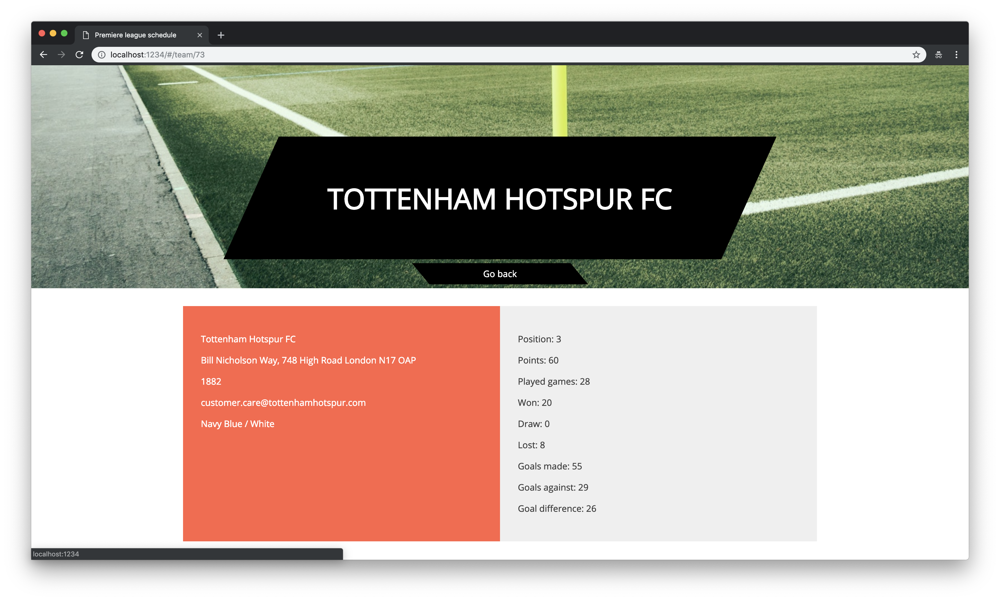
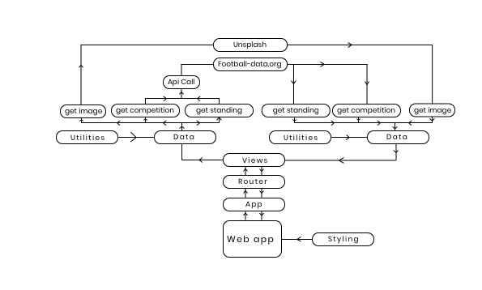
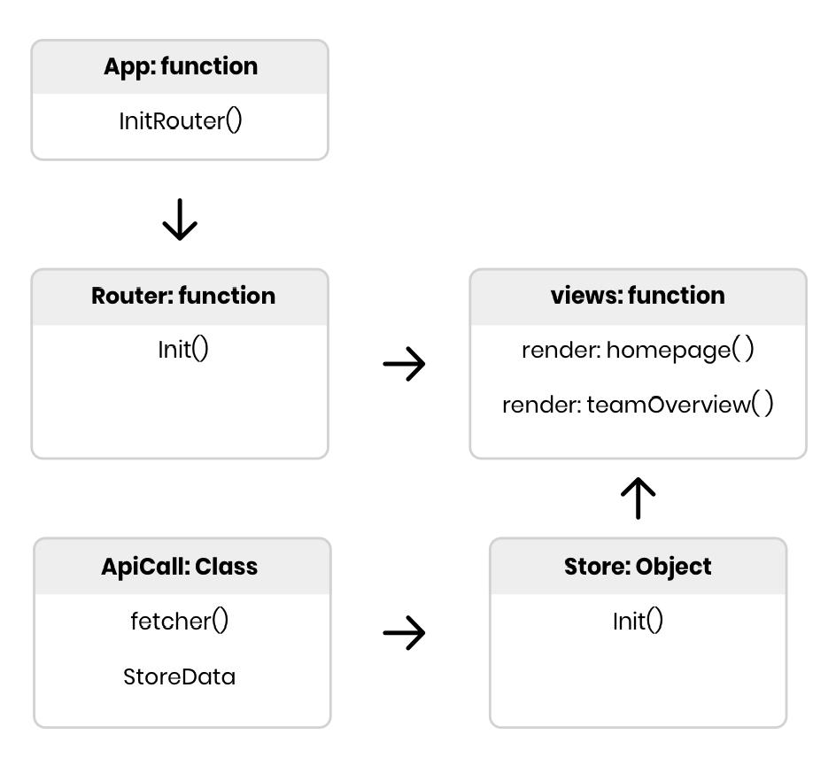
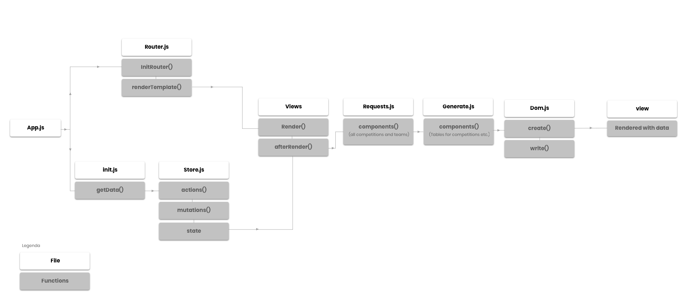
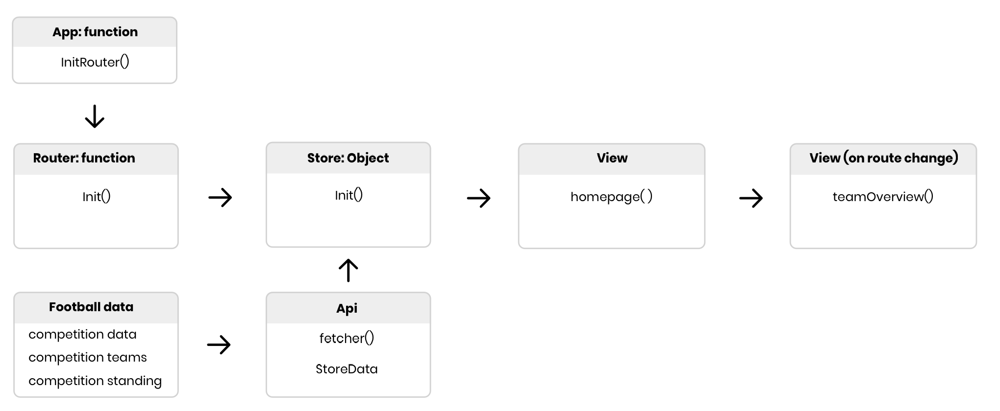
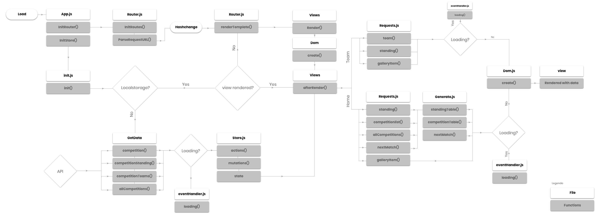

# Web App From Scratch @cmda-minor-web 18-19

In this project I build a Web app from scratch using API. The use case of this project is viewing the DATA and getting specific information about the DATA.

## Table of Contents

1. [Live demo](#live-demo)
2. [Installation](#installation)
3. [Description](#description)
4. [Which actors are there in my application](#which-actors-are-there-in-my-application)
5. [What design patterns and best practices did I use](#What-design-patterns-and-best-practices-did-I-use)
6. [What API has been used and what is the limit of the API](#What-API-has-been-used-and-what-is-the-limit-of-the-API.)
7. [How does interaction flow through the application](#How-does-interaction-flow-through-the-application)
8. [What design patterns and best practices did I use](#What-design-patterns-and-best-practices-did-I-use)
9. [What I have learned](#What-i-have-learned)
10. [Highlighted code](#Highlighted-code)
11. [What do I want to add to the project](#What-do-I-want-to-add-to-the-project)
12. [Technologies used](#technologies-used)
13. [Data sources](#data-sources)
14. [License](#license)

## Live demo

The live demo can be found at: [https://web-app-from-scratch-tim.netlify.com/](https://web-app-from-scratch-tim.netlify.com/)

|          Landings page          |           Overview page           |
| :-----------------------------: | :-------------------------------: |
|  |  |

## Installation

Clone the repository through:

```bash
git clone https://github.com/timruiterkamp/web-app-from-scratch-18-19.git
```

Install the dependencies

```bash
  yarn or npm install
```

Run the project

```bash
  npm run start
```

## Description

My app is a representation of the current premiere league standing with the possibility to get insight to a club. And how they performed individually.

## Features

- Landing page with the Premier League competition standing and upcoming matches
- Router
- Virtual DOM
- Store
- Event handlers
- Detail page rendering
- Before and After render functions

## Which actors are there in my application?

<details>

<summary>Week 1 (trying to find out how the actor diagram works)</summary>



</details>

<details>

<summary>Week 2: simplified the actors and chose the main actors of my application.</summary>



</details>

<details open>

<summary>Week 3: Gave more meaning to the actors and detail to what they do.</summary>



</details>

## What API has been used and what is the limit of the API.

The api that has been used is the [football-data API](https://football-data.org). The football-data API is a very big dataset with over 176 competitions in it, container every information about the clubs in the competitions and the players in the clubs.

Limits:

- Scores delayed by 5 minutes
- 10 calls/minute (600 per hour)

Data that I used:

- Premiere League competition
- Premiere League standing
- Premiere League clubs
- Premiere League players

To solve the issue with the minimal calls I set the localStorage the first time ever the page loads so the data will be stored and no calls would be needed when revisiting a page.

To connect with the several endpoints of the API I created a class which makes the calls based on a given url.

The class looks as following:

```javascript
class ApiCall {
  constructor() {
    this.apiKey = process.env.FOOTBALL_API_KEY;
  }

  fetcher(url) {
    return fetch(url, {
      headers: { "X-Auth-Token": this.apiKey }
    })
      .then(data => data.json())
      .catch(err => console.error(err));
  }
}

export default class GetData extends ApiCall {
  async competition(url) {
    const data = await super.fetcher(url);
    Store.dispatch("setCompetition", data);
  }
}
```

And to get the Premier League standing for example I would use the following code:

```javascript
const competition = {
  key: 2021,
  name: "PL"
};
const apiURL =
  "https://cors-anywhere.herokuapp.com/https://api.football-data.org/v2";
const calls = {
  standing: `${apiURL}/competitions/${competition.key}/standings`
};

const get = new GetData();
await get.competition(calls.competition);
```

## How does interaction flow through the application

The user will be landing on the homepage where they can find information about the club in the Premiere League they support, they can see their score, goals made / goals against, standing on the league table and opponents they have to face in the next round of the Premiere League.

If they are interested in their team or in the team they have to face in the next round, they can click on the team name and look through their club information and highlighted standing.

<details>

<summary>Week 2:</summary>



</details>
<details open>

<summary>Week 3:</summary>



</details>

## What design patterns and best practices did I use

For the code I tried to find myself a style which would consist of class module and functional modules usage where they would belong. Because in my opinion not every little function should be contained in a class, only if it's meaningful. The data loading would consist of loading the data async and while loading the data the loading template would occur, to give the user feedback.
I also tried to use ES6 functionalities like arrow functions in functional modules. Why I would do this, is because this automaticly binds `this` to the scope, where as non arrow function, the this could belong to the parent's scope.

How I solved this on the front-end is to give the user feedback whenever he/she did something wrong or there was an error in het code, which would result in data not being loaded. For this I created an event handler which consists of loading and error solutions.

## What I have learned

I have to say that this course was very fun to do, because you could go as deep in the functionalities as you like. Over the past three weeks I learned about creating your own store, router and virtual DOM. Also the differences between injecting HTML into your front-end with for example `element.innerHTML` and create DOM nodes which are a much safer way to inject data into the front-end.

Overall the course was really fun to do, and I'm glad that I have experimented with many aspects of a web app (from scratch).

## Highlighted code

I'm quite proud of how I solved things like my own virtual DOM and my store.

The store for example exists out of 6 aspects:

- The Store functionality
- The Store handler, which directs action to the store to the correct functions.
- Actions, here the data would be put inside the state
- Mutations, here are the dispatch functions declared
- State, here are the default states of the mutations/actions.
- Index, which includes everything together and makes the Store reachable.

A representation of the workflow goes as following:

The state will be defined first so that mutations and actions can be directed towards it.
The state is just an object that is being exported to the index file and made available for the actions and mutations.

```javascript
competition: {},
```

the mutations are defined after the state is set:
The state is the defined state and the payload the data that needs to be added to the state.

```javascript
setCompetition(state, payload) {
    state.competition = payload;
    return state;
  },
```

My actions would be declared like this:
The context is the mutations that has to be called and the payload is the data that needs to be handled

```javascript
setCompetition(context, payload) {
  localStorage.setItem("competition", JSON.stringify(payload));
  context.commit("setCompetition", payload);
},
```

The way I use this in my project is as following:

```javascript
// to store data in the state
Store.dispatch("setCompetition", data);

//to gather the stored data
Store.state.competition;
```

## What do I want to add to the project?

- [x] Render a list from the data
- [x] Views generated based on route
- [x] fix routing
- [x] Virtual DOM (If there is time)
- [x] Team overview
- [ ] Multiple competition support
- [x] Better design
- [ ] Select own competition
- [x] Fix styling
- [x] Build out the template engine
- [ ] Loading states
- [x] Store
- [x] Minimize calls with localStorage
- [ ] Gather last played matches per team

## Techniques used

- ParcelJS
- Fetch
- Hashrouter
- ES6+

## License

This repository is licensed as [MIT](LICENSE) by [Tim Ruiterkamp](https://github.com/timruiterkamp).
